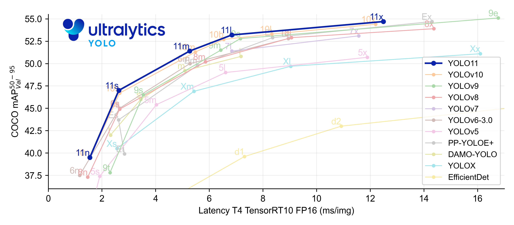
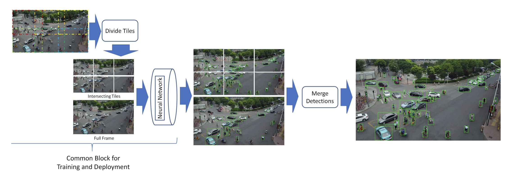

# **Transfer Learning in Object Detection Models**

## **1.  Steps**

### **1.1. Data Collection & Preprocessing**
- **Collect and label images**
- **Verify label accuracy** and correct any annotation mistakes.
- **Split the dataset** into `train`, `val`, and `test` sets using a typical ratio like 70/20/10.
- **Check class balance**: Ensure each class has a similar number of instances.
  - If imbalanced, **use Linear Integer Programming (LIP)** to create a solver that guides augmentation to achieve balance.

### **1.2. Configuration Files**
- **Create a data YAML file** specifying:
  - Paths to `train`, `val`, and `test` folders.
  - `nc`: Number of classes.
  - `names`: List of class names.
- **Edit YOLO-specific model config YAML**:
  - Located in `models/detect/`.
  - Update `nc` (number of classes).
- **Choose hyperparameters YAML**:
  - Start with `hyp.scratch-high.yaml` or customize as needed.

### **1.3. Environment Setup**
- **Install required libraries**.
- **Check for dependency conflicts**, especially PyTorch and CUDA versions.
- **Link experiment tracking tools** like Weights & Biases (W&B), MLflow, or Comet using appropriate API credentials.

### **1.4. Training Configuration**
- **Create a `training_config.yaml` file** specifying:
  - `n_workers`, `device(s)`, `batch_size`
  - Path to data YAML and model config
  - Initial weights (`.pt`)
  - Hyperparameters
  - `epochs`, `patience`, `evolve` (if applicable)
- **Write a script** to parse the `training_config.yaml` and apply it to `train.py` or `train_dual.py`.

### **1.5. Execution**
- **Run training**. Always blows up at the beginning, such a surprise:
  - Common PyTorch/CUDA version errors — debug and retry.
- **Consider cloud training**:
  - If available, **launch batch jobs** using endpoints on Azure, GCP, or AWS to avoid running directly on the target machine.

---

## **2. Potential Issues & Mitigation**

| Issue                              | Description / Risk                        | Mitigation                                     |
|-----------------------------------|-------------------------------------------|------------------------------------------------|
| Metrics fluctuate too much     |  unstable training            | Check learning rate (value too large) and data noise          |
| Training loss stagnates           | Model not learning                        | Check hyperparameters, dataset quality, config errors      |
| Class confusion with background   | False negatives                           | Improve labeling, increase samples per class  |
| Wrong label format                | COCO vs YOLO vs Pascal VOC                | Ensure format matches model expectations      |
| Zero metrics during training      | Possibly broken data pipeline or config   | Double-check data YAML, paths, and label structure |

---

## **3. Data Estimation & Expected Performance**

- **Transfer learning reduces data needs** compared to training from scratch.
- **YOLO baseline**: ~120,000 images per category for full training.
- **Recommended for transfer learning**:
  - Minimum: **100 images per new class**
  - Acceptable: **~500 images**
  - Ideal: **>1000 images**

---

## **4. Techniques to Improve Model Performance**

### **During Training**
- **Use `Albumentations` library** for advanced image augmentation.
- Apply **class-balanced augmentation** if using LIP ()

### **At Inference Time**
- **Model scaling**: Use a smaller YOLO variant for faster inference (at the cost of accuracy).  
    
    > _Reference: [Ultralytics model variants chart](https://docs.ultralytics.com/models/)_
- **Tiling for small objects**:
  - Split input image into smaller tiles.
  - Run detection on each tile.
  - Merge results into original image space.
  - **Challenges**: Instance cut-off, double counting — requires post-processing.
  
  
  > _Reference: [The Power of Tiling for Small Object Detection (CVPRW 2019)](https://openaccess.thecvf.com/content_CVPRW_2019/papers/UAVision/Unel_The_Power_of_Tiling_for_Small_Object_Detection_CVPRW_2019_paper.pdf)_

